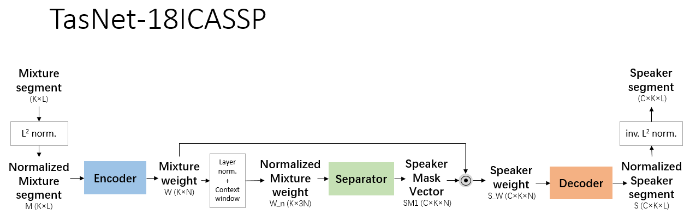

# TasNet: Time-domain Audio Separation Network
This is the implementation in Tensorflow of "TasNet: 
Time-domain Audio Separation 
Network for Real-time, single-channel speech separation", published in ICASSP2018, by Yi Luo and 
Nima Mesgarani.

## Special
This implementation takes [ododoyo's](https://github.com/ododoyo/TASNET) as 
reference, especially in SI-SNR and PIT training part. A extra MSE training objective and PIT 
training policy is implemented by myself. Also, this implementation haven't supported 
variable-length segments in training so far.  
Discussion, (friendly) criticism, suggestions are always welcomed!

## Requirements
* tensorflow 1.8.0
* python 3.5
* librosa

## Contents

* `params.py` defines all global parameters.
* `data_generator.py` This file establishes WSJ0 2-mix datasets (referred to ICASSP 2016 Deep 
Clustering paper) and generates batch data for training. You may run this code firstly to 
generate datasets and change the path in `tf_train.py`.
* `tf_net.py` defines the TasNet structure, loss, training optimizer, etc.
* `tf_train.py` trains the model. Rewrite the dataset path with your own path.
* `tf_test.py` evaluates the model performance. This code hasn't been written well, still under 
repair.
* `mir_eval.py` and `mir_util.py` are forked from [ododoyo's](https://github.com/ododoyo/TASNET),
implementing bss_eval calculation in Python rather than MATLAB.
